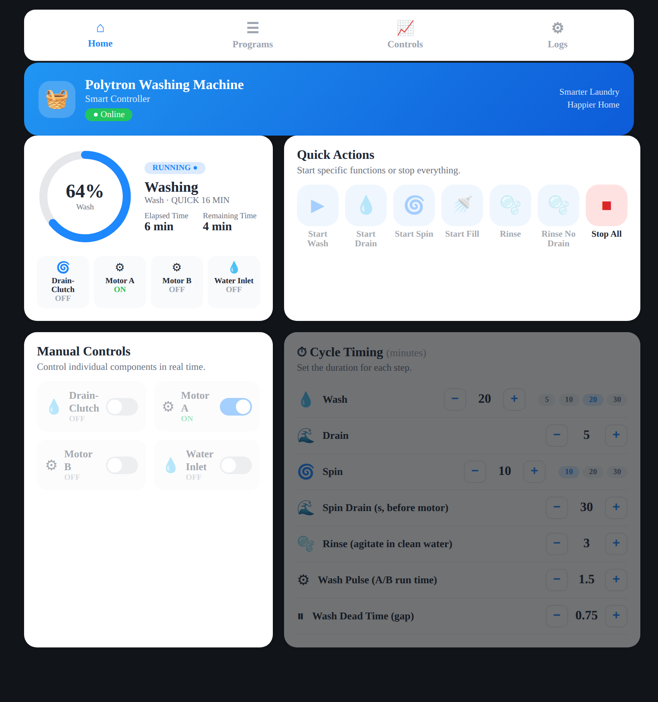
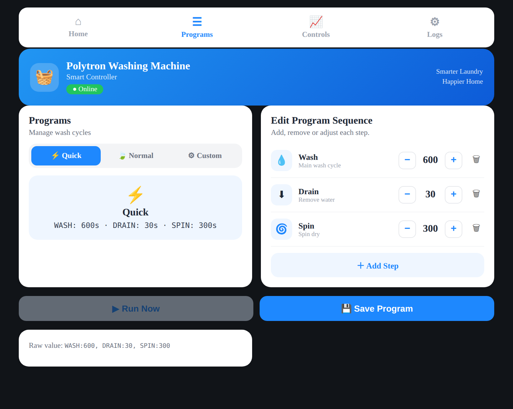
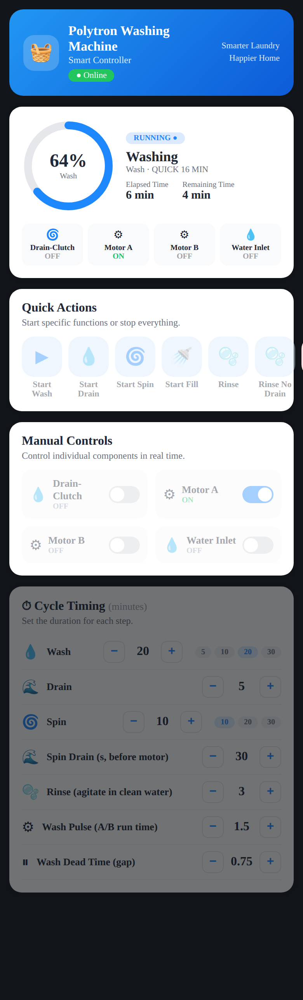

# Polytron Washing Machine — ESP32 + ESPHome

A top-load Polytron washer converted to **fully manual, software-defined
control**: an ESP32 drives relays wired straight to the motor, drain
solenoid and water inlet, so every part of the wash cycle — pulse timing,
spin speed control, drain, fill — becomes data you can change from Home
Assistant, the device's own web UI, voice, or an AI agent. The machine's
factory controller is simply unplugged.

```
Google Assistant ──> Home Assistant ──> ESPHome API ──> ESP32 ──> relays ──> motor / drain / inlet
Cursor / Claude  ──> ESPHome MCP  ──────────────┘            (native API, port 6053)
```

## The device's own web UI

The firmware embeds a **custom appliance UI** (`ui/www.js` — vanilla JS,
no framework, no build step, no CDN) served straight from flash via
`web_server.js_include`: ~8 KB gzipped vs ~140 KB for the stock ESPHome
frontend. It drives the device over the ESPHome REST API, with `/events`
SSE pushing state and logs live.

| Desktop (≥ 900 px) | Mobile |
|--------------------|--------|
|  |  |


- **Cycle Status** — program + step chips, whole-program progress bar,
  elapsed/remaining, free heap, WiFi signal.
- **Quick Actions** — icon tiles (matching the HA card) for
  wash/spin/drain/fill, **Rinse** / **Rinse No Drain**, and saved
  programs. Everything except **STOP ALL** locks while a cycle runs, and
  a sticky STOP bar follows you down the page.
- **Program Sequences** — the three persistent `NAME:seconds` slots with
  live validation and a computed total (SPIN steps include the
  drain-prep + coast window, read live from Spin Drain Seconds).
- **Timing & Presets** — steppers and preset chips for every
  runtime-tunable number (incl. Spin Drain Seconds, Rinse Drain Seconds,
  Rinse Minutes).
- **Manual Relays** (collapsed) — direct relay control for testing;
  firmware interlocks still apply.
- **OTA Update + Debug Log** (log collapsed) — flash a firmware `.bin`
  from the browser and watch the device log live.

Responsive: two-column grid on desktop, single column with a 2×2
quick-action grid on phones (`www.js` injects its own viewport meta —
ESPHome's stock shell omits one). **Theme follows your device
automatically** — light or dark via the OS setting, like the HA card;
the mobile browser chrome (status-bar color) matches too. No auth by
default (trusted local WiFi); a digest-auth block is commented in the
yaml if you ever want it. `ui/mock-server.py` fakes the device API so
the UI can be exercised offline.

> **Router down?** About a minute after losing the configured AP the
> ESP32 starts its own hotspot (**Polytron Wash Setup**) and serves the
> *same* full UI at `http://192.168.4.1` — control and OTA work with no
> LAN at all. It rejoins your WiFi automatically once the router is
> back.

## Hardware architecture (v3 — `polytron-v3.yaml`)

| Relay | GPIO | Drives | Notes |
|-------|------|--------|-------|
| Motor A | GPIO19 | motor winding / capacitor tap A | interlocked with Motor B |
| Motor B | GPIO21 | motor winding / capacitor tap B | interlocked with Motor A |
| Drain + clutch | GPIO22 | drain solenoid (engages gearbox clutch too) | interlocked with Inlet |
| Inlet valve | GPIO18 | water inlet solenoid | interlocked with Drain |

Relay modules are active-LOW (`relay_active_low: "true"` substitution) —
flip the substitution if yours are active-HIGH.

### How the cycles work

- **WASH** — the motor alternates A/B in pulses (`wash_on_ms` energized,
  `wash_dead_ms` dead time between directions, both runtime-tunable
  0.5–10 s / 0.5–5 s from HA or the web UI).
- **SPIN** — drain ON and pumping for `Spin Drain Seconds` (default 30 s,
  runtime-tunable) before the motor starts, so the water is gone and the
  clutch engages dry →
  one direction continuously (A or B — selectable in config via the
  `spin_motor` select, no rewiring) → coast (`spin_coast_s`) → drain OFF.
- **DRAIN / FILL** — single solenoid for the configured duration.
- **RINSE** — clean-water wash, no detergent, no spin: pre-drain (`Rinse
  Drain Seconds`, default 45 s) → refill → agitate `Rinse Minutes`
  (default 3 min) → drain again (same `Rinse Drain Seconds`). One button
  press, voice command, or `rinse()` API action. A second variant,
  **Rinse No Drain**, skips the leading pre-drain for when the tub is
  already empty (after a wash program or Keringkan) — the trailing drain
  still uses `Rinse Drain Seconds` so leftover water clears fully. Both
  drain durations are runtime-tunable in HA or the device web UI without
  re-flashing.
- **STOP ALL** — motors + inlet cut instantly; if a spin was running the
  drum coasts `stop_coast_seconds` before the clutch brake engages.

### Safety interlocks (enforced in firmware, C++-level)

- Motor A and Motor B can **never** be ON together (hardware interlock +
  500 ms wait time — dead time between directions).
- Inlet and Drain can **never** be ON together.
- A cycle start is **refused** while another cycle runs — interrupting a
  spin or wash requires the explicit STOP ALL button (which does the
  controlled coast-then-brake sequence for a spinning drum).
- `on_client_disconnected` triggers STOP ALL: if the controller (HA)
  disappears mid-cycle, nothing keeps running. Remove that trigger only
  once the machine is supervised.

> ⚠️ **Mains safety**: the motor circuit carries AC mains. Use
> motor-rated relays or a contactor (16 A+) for the motor channels, put a
> fuse (e.g. 5 A) in series with the motor, wire the lid switch in series
> with the motor line so the motor physically cannot run with the lid
> open, and never work on the wiring with the machine plugged in.

## Agent / service API

High-level actions registered on the ESPHome API (usable from HA scripts,
automations, voice, or MCP agents):

```
wash(duration_s)   drain(duration_s)   spin(duration_s)   fill(duration_s)   rinse()   stop_all()
```

Programs are **data on the device** — three persistent text slots edited
at runtime, comma-separated `NAME:seconds`:

```
WASH:600, DRAIN:30, SPIN:300      # Quick
WASH:480, DRAIN:60                # Normal
```

Preset selects (Wash 5/10/20/30 min, Spin 10/20/30 min) plus minute
number entities feed one-tap Start buttons, so common cycles are two
taps or one voice command.

## What Home Assistant sees

- `button.*` — Start Wash/Spin/Drain/Fill/Rinse/Rinse No Drain, Run Quick/Normal/Custom, STOP ALL
- `switch.*` — the four raw relays (manual/MCP control; interlocks still apply)
- `number.*` — wash/spin/drain/fill/rinse minutes, spin drain seconds, rinse drain seconds, wash pulse + dead time, spin coast seconds
- `select.*` — wash preset, spin preset, spin direction (A/B)
- `text.*` — the three editable program slots
- `sensor.*` — cycle state, step + whole-program progress %, elapsed/remaining, free heap, WiFi signal (dBm)
- `binary_sensor.*` — cycle running

## Home Assistant setup (`ha/`)

### Dashboard card — `ha/www/polytron/polytron-washer-card.js`

A single-file custom card (vanilla JS, shadow DOM, no build step) that
turns the washer's entities into a phone-shaped appliance panel:

| Home (running) | Program editor |
|----------------|----------------|
|  |  |



The UI/UX follows the same ideas as the device web UI, adapted to the
HA card shell:

- **Progress ring** — the whole-program progress (same sensor as the
  device UI, so both always agree), colored by mode (WASH blue / DRAIN
  teal / SPIN purple / FILL cyan) with elapsed/remaining beside it.
- **Live relay chips** — the four loads as compact on/off pills, so a
  glance tells you what's energized without opening Manual Controls.
- **Quick Actions** — one-tap starts for wash/spin/drain/fill, both
  rinses, saved programs, and a red STOP ALL. Everything but STOP
  locks while a cycle runs (`dis` state), mirroring the firmware's
  one-cycle-at-a-time gate.
- **Cycle Timing** — ± steppers and preset chips (5/10/20/30) for the
  minute settings, plus Spin Drain Seconds and Rinse — all live number
  entities, no re-flash to retune.
- **Programs tab** — a step editor for the three persistent sequences
  (add/remove steps, ± duration, save straight to the device's `text.*`
  slots, Run from the card).
- **Responsive** — two-column layout on wide screens, stacks to a
  single column with a bottom tab bar on phones.

Install: serve from `/config/www/polytron/` and register in
**Settings → Dashboards → Resources** as
`/local/polytron/polytron-washer-card.js` (type: module).

### Voice, automations, YAML dashboard

- `ha/scripts.yaml` — voice presets in **Bahasa Indonesia**
  (`Cuci`, `Cuci 20 Menit`, `Bilas`, `Keringkan 10 Menit`, `Buang Air`,
  `Isi Air`, `Stop Mesin Cuci`, …; English names kept as aliases).
  Expose the scripts to Google Assistant and add Bahasa Indonesia in
  Google Assistant's language settings →
  *"Ok Google, aktifkan Cuci 20 Menit"*, *"aktifkan Bilas"*,
  *"aktifkan Keringkan"*.
- `ha/automations.yaml` — push/notification when a cycle finishes, and a
  **fill-pump follow** automation that mirrors the inlet valve onto an
  external pump smart-plug (works for every fill: Fill, both rinses,
  program steps). Wired to a CozyLife plug via the
  [`cozylife_local`](https://github.com/soulripper13/cozylife_local)
  community integration (fully local); swap the entity id in the
  automation for any other plug.
- `ha/polytron_dash.yaml` — YAML-mode dashboard alternative: same ring /
  mode colors / locking rules in pure Lovelace YAML.

## Getting started

```bash
cp secrets.yaml.example secrets.yaml   # then fill in WiFi + generate an API key
pip install esphome                    # or use the ESPHome docker image
esphome run polytron-v3.yaml           # first flash over USB, then OTA
esphome logs polytron-v3.yaml          # live logs over WiFi
```

Once flashed, the web UI is at `http://polytron-wash2.local/` (or the
device's IP — the same UI also appears on the fallback hotspot at
`192.168.4.1`).

The [aioesphomeapi](https://github.com/esphome/aioesphomeapi) test
scripts in **`tools/`** (device info, entity listing, live watcher,
relay matrix, acceptance run…) are optional PC-side clients — see
`tools/README.md`. They read the key from `secrets.yaml` via
`common.py`; set `WASHER_HOST` to override the device hostname.

## Repo layout

```
polytron-v3.yaml        current firmware — direct motor/drain/spin control
polytron.yaml           legacy v2 — relay "button bridge" across the panel buttons
ui/www.js               custom ESPHome web UI (embedded via js_include)
ui/mock-server.py       offline mock of the ESPHome REST/SSE API for UI tests
docs/screenshots/       web UI screenshots used by this README
secrets.yaml.example    template for the git-ignored credentials
tools/                  PC-side test/debug scripts (see tools/README.md) —
                        the ESP32 runs C++ only, never these
flash.sh, net-watch.sh, air-watch.sh, Dockerfile.flash   flashing helpers
ha/                     Home Assistant dashboard, custom card, voice scripts
```

## Notes

- Device hostnames: `polytron-wash.local` (v2) / `polytron-wash2.local` (v3).
- WiFi credentials persist in NVS across OTA and USB reflashes — you only
  enter them once (captive portal on first boot if the configured AP is
  unavailable).
- A stray active-HIGH relay module that clicks on at boot: set
  `relay_active_low: "false"` and re-flash.
